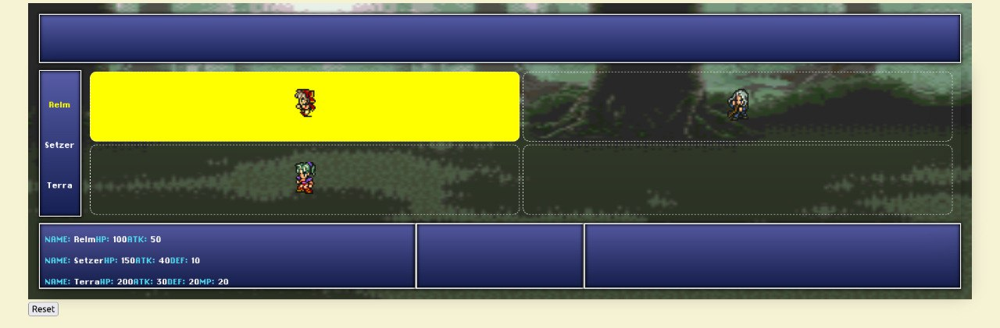

# Proyecto Semestral: Final Reality Tactics

## Descripción del Proyecto

Este repositorio contiene la plantilla base para el proyecto semestral del curso. El objetivo principal es desarrollar una versión simplificada de un juego de combate táctico, enfocado exclusivamente en la implementación de la lógica de negocio mediante el patrón arquitectónico **Modelo-Vista-Controlador (MVC)**. 

En particular, a lo largo del semestre trabajarán en la construcción del **Modelo** (las entidades del juego como personajes, armas, paneles y sus interacciones mediante acciones) y el **Controlador** (el motor lógico encargado de gestionar los turnos, flujo del juego y reglas, como `GameController`). No se implementará una Vista gráfica (frontend), por lo que todo se basará en código Scala puro.

## Referencia Visual

Aunque el proyecto se evaluará mediante pruebas unitarias y lógica de consola sin necesidad de conectarlo a una interfaz web, aquí tienen una imagen del "front-end" conceptual del juego. Esto les servirá para hacerse una idea de cómo deberían verse estructurados lógicamente el mapa (en base a paneles) y sus unidades a lo largo de las entregas:

## Enunciado del Proyecto

Las reglas completas del juego, las entidades requeridas y el detalle de cada entrega parcial y final pueden encontrarse en el enunciado oficial del proyecto.

👉 **[Enlace al enunciado completo del proyecto] (El cuerpo docente colocará el link aquí pronto)**

## ¿Qué se estará evaluando?

El trabajo a lo largo del semestre será evaluado principalmente en base a los siguientes tres pilares:

1. **Diseño (50%)**: Se evaluará la calidad de su código, exigiendo que este cumpla con los principios de diseño orientado a objetos enseñados en el curso. Se espera un código extensible y con responsabilidades bien definidas.
2. **Testing y Coverage (35%)**: Se evaluará que su código tenga pruebas automatizadas utilizando **MUnit** con una cobertura de al menos el 90% para obtener el puntaje completo. Las pruebas deben comprobar tanto los casos de uso esperados como los casos de borde (ej. fallos en restricciones de acciones).
3. **Documentación (15%)**: Cada clase, interfaz (trait) y método público debe estar debidamente documentado usando el formato Scaladoc.

## Cómo empezar

1. Lean detenidamente el enunciado principal del proyecto.
2. Exploren este código base. Encontrarán una clase inicial `GameController` en el paquete `controller` desde la cual podrán comenzar a articular su lógica.
3. Asegúrense de usar herramientas de control de versiones (Git) de manera constante, documentando adecuadamente sus avances mediante *commits*.
